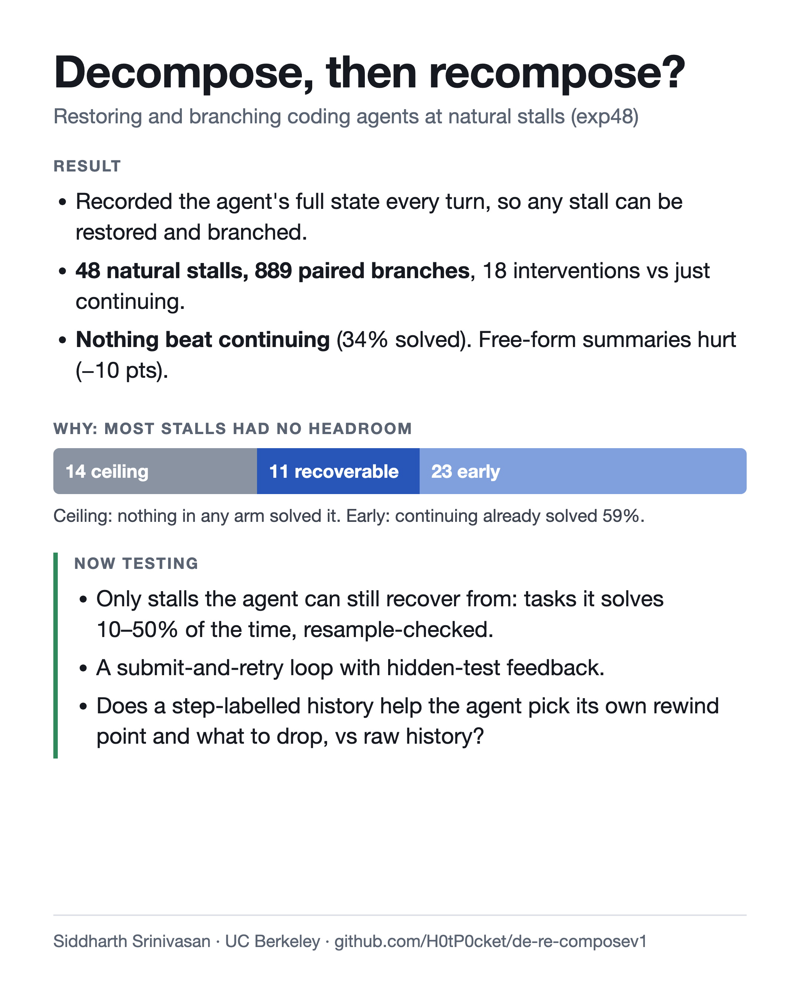
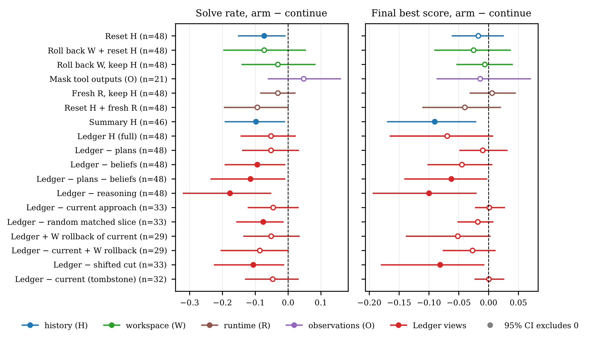
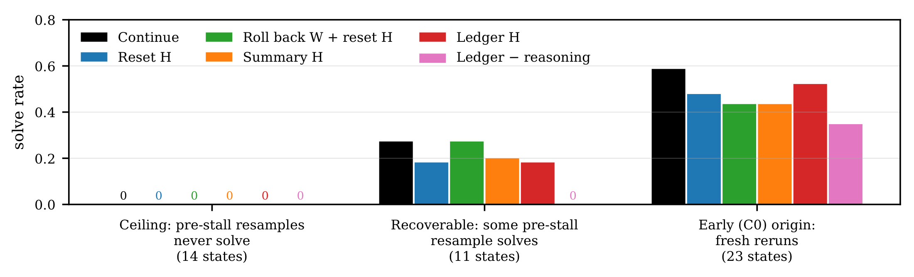

# Decompose, then recompose?

Restoring and branching coding agents at natural stalls: results of **exp48**, a paired test of 18 state interventions against simply letting the agent continue.

Siddharth Srinivasan · UC Berkeley · independent research

## TL;DR

- I built a harness that records a coding agent's full state every turn (conversation history H, workspace W, runtime R, tool observations O), so any checkpoint can be restored exactly and branched.
- From **48 natural stalls** I ran **889 paired branches**: 18 interventions against plain continuation, on two low-cost reasoning models (DeepSeek V4.1 Flash, GPT-6 Luna), with hidden-test grading and 40k generated tokens per branch.
- **Nothing beat continuing**, which solved 34% of branches. Rewriting the history as a free-form summary cut the solve rate by 10 points.
- The null was mostly about **headroom**: in 14 of the 48 stalls nothing in any arm solved the task, and only 11 stalls were recoverable at all.

## Method

1. **Record every turn.** Agents (mini-SWE-agent, one bash tool) run on tasks with hidden tests. Each turn checkpoints H, W, R and O. A checkpoint is branchable only after a restore reproduces its workspace and runtime manifests and its history exactly.
2. **Detect stalls live.** A token-based stall clock flags candidates on unmodified runs (at least 10k generated tokens and 5 turns without measurable progress, or a repeated rejection on the same requirement), and an LLM judge confirms each one. The worker never sees the detector.
3. **Measure headroom first.** Before any intervention ran, each stall was resampled about five times from its last progress point, which sorts stalls into recoverability classes without looking at intervention outcomes.
4. **Branch and grade.** Each of the 48 stall states (from 25 original runs on 20 MettleBench and SWE-smith tasks) is restored into every arm and graded by hidden tests. Arms are compared with continuing from the same checkpoint, paired per state, with 95% intervals from a cluster bootstrap over the 25 stall origins.

## Results

Change against continuing, in points (95% CI). **Bold** = interval excludes zero.

| Arm | Solve rate | Best partial score |
|---|---|---|
| *Resets and rollbacks* | | |
| Reset H (task prompt only) | **−7.3 (−15 to −1)** | −1.7 (−6 to +2) |
| Fresh R, keep H | −3.1 (−8 to +2) | +0.6 (−3 to +4) |
| Reset H + fresh R | −9.4 (−19 to 0) | −4.0 (−11 to +2) |
| Roll back W, keep H | −3.1 (−14 to +8) | −0.6 (−5 to +4) |
| Roll back W + reset H | −7.3 (−20 to +5) | −2.5 (−9 to +4) |
| Mask tool outputs (O) ‡ | +4.8 (−6 to +16) | −1.4 (−9 to +7) |
| *History rewrites* | | |
| Free-form summary of H | **−9.8 (−19 to −1)** | **−9.0 (−17 to −2)** |
| Ledger (full) | −5.2 (−14 to +2) | −6.9 (−16 to +1) |
| Ledger minus plans | −5.2 (−14 to +3) | −1.0 (−5 to +3) |
| Ledger minus beliefs | **−9.4 (−19 to −1)** | −4.5 (−10 to +1) |
| Ledger minus plans and beliefs | **−11.5 (−23 to −1)** | **−6.2 (−14 to 0)** |
| Ledger minus the model's reasoning | **−17.7 (−32 to −5)** | **−10.0 (−19 to −2)** |
| *Approach-boundary removals* † | | |
| Remove the current approach | −4.5 (−12 to +3) | +0.1 (−2 to +3) |
| Remove it, keep a tombstone | −4.7 (−13 to +3) | +0.1 (−2 to +3) |
| Remove a size-matched random slice | **−7.6 (−16 to −2)** | −1.8 (−5 to +1) |
| Remove with the cut shifted earlier | **−10.6 (−22 to −1)** | **−8.1 (−18 to −1)** |
| Ledger + roll back W of the current approach | −5.2 (−13 to +3) | −5.2 (−14 to 0) |
| Remove current approach + roll back W | −8.6 (−20 to 0) | −2.7 (−8 to +1) |

Continue solved 34% of branches (best score 0.80). † Only on the 33 states with two or more labelled approaches. ‡ Buildable on only 21 states, mostly easy ones. No correction for multiple comparisons; read the intervals as descriptive.

### Why the null: headroom

- **Ceiling (14 states).** No pre-stall resample solved the task, and no branch in any arm did either.
- **Recoverable (11 states).** At least one pre-stall resample solved. Continuing solved 27%; with 11 states and about one repeat per arm, the arms cannot be separated.
- **Early origin (23 states).** No progress before the stall, so the resamples were fresh reruns; continuing already solved 59%.

### What the results do and don't show

- **Summaries lose information that matters.** A length-matched free-form summary cut the solve rate by 10 points, and on partial score it did worse than giving the agent no history at all.
- **The Ledger arms mixed compression with removal.** Each replaced the history with a roughly 3k-token verbatim extract, and every removal shrank it further, so the ablations mostly measured how much text was removed (removing the model's reasoning also removed a median 83% of the text). Removing labelled pieces from the *full* history was never tested.
- **Runtime and workspace rollbacks changed nothing measurable.**
- **Rewrites cost more per solve.** They used 23–29k generated tokens per branch against 19k for continuing (the agent re-orients first), and $0.11–0.32 per solve against $0.10.
- **Eval quality.** In 21 of 50 SWE-smith tasks I packaged, the injected bug patch left comments that describe the bug, and DeepSeek V4.1 Flash spent about 30% of its commands hunting for hidden tests on those tasks. Details in [notes/swe-smith-comment-leaks.md](notes/swe-smith-comment-leaks.md).

## What's in this repo

| Path | Contents |
|---|---|
| [`paper/exp48-preprint.pdf`](paper/exp48-preprint.pdf) | The full preprint (15 pages): setup, all 18 arms, headroom accounting, label reliability, limitations. |
| [`paper/exp48-summary.pdf`](paper/exp48-summary.pdf) | A 2-page summary. |
| [`data/exp48-branches.csv`](data/exp48-branches.csv) | One row per recorded branch (889): `state`, `origin_cluster`, `arm_id`, `arm`, `repeat`, `model`, `task`, `stall_type`, `recoverability`, `start_score`, `best_score`, `solved`, `generated_tokens`, `usd_known` (a lower bound), `usd_complete`. |
| [`analysis/paired_vs_continue.py`](analysis/paired_vs_continue.py) | Rebuilds the results table from the CSV (standard library only). `python analysis/paired_vs_continue.py`, optionally with `--population recoverable`. Point estimates match the preprint exactly; intervals match up to bootstrap noise, and the two that touch zero (Reset H and the shifted cut, on solve rate) can fall on either side of it depending on the seed. |
| [`src-excerpt/`](src-excerpt/) | Four files from the private harness: workspace and runtime capture and validated restore, event recording, the stall detector, and how arms declare which checkpoint donates each state channel. Excerpts only; they do not run on their own. |
| [`notes/`](notes/) | The SWE-smith comment-leak finding with examples. |

## Caveats

Most arms ran once per state because the run was stopped early to cap spending (only continue completed two repeats everywhere). Stall labels come from an LLM judge, and a second opinion agreed on 34 of 47 reviewed states. Stall type, model, benchmark and recoverability class are strongly entangled in this sample of 48 states.

## Next steps

The follow-up study is built around what exp48 got wrong:

- **Only stalls with headroom.** Terminal-Bench 2.x tasks the model solves 10–50% of the time across repeated runs, screened with my own runs, and a stall counts only if at least 1 of 5 resamples from just before it still solves.
- **A submission loop.** When the agent says it's done it hears how many hidden tests fail and keeps working, so early wrong submissions become real stalls instead of quits.
- **A simpler, validated Ledger on the full history.** Each step is labelled (which approach it belongs to, whether its output is now stale, and the facts, claims and ideas it contains as exact quotes), with no compression into a fixed-size extract, and the labels are checked against two human labellers.
- **The agent recomposes itself.** At the stall it sees its full state, either labelled or raw, then picks a rewind point and what to drop. The headline question is whether the decomposition helps the agent recompose itself, compared with raw history.
- **8 arms with equal repeats** (about 10 per stall) instead of 19 arms with about one, including a rewind plus self-written summary baseline (the AgentRewind / Reflexion pattern) and a one-sentence hint as a positive control.
- **Process measures beyond solve rate.** Whether the agent goes back to the idea that just failed, how fast it starts a new one, and what each arm costs with and without prompt caching.
